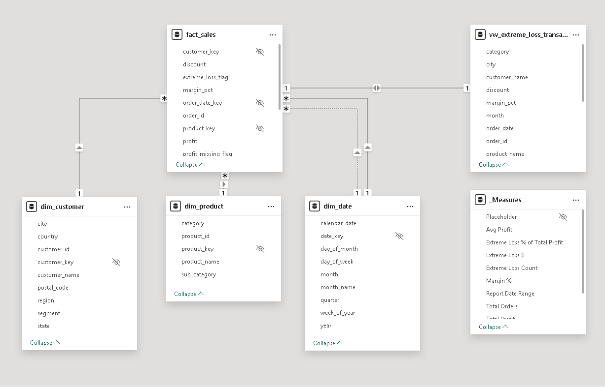
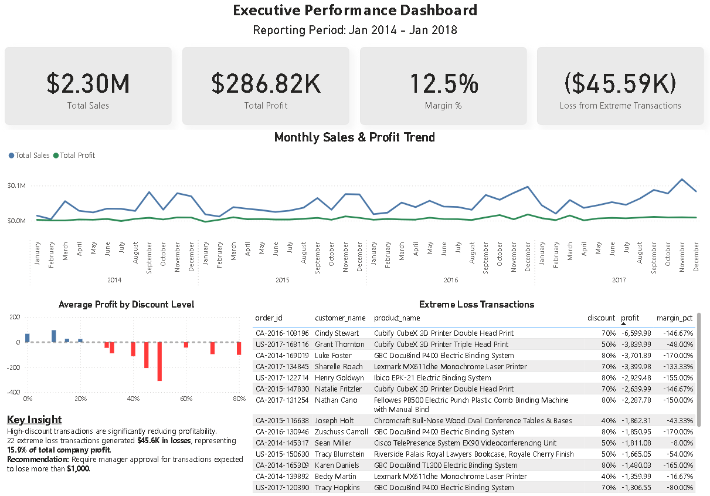
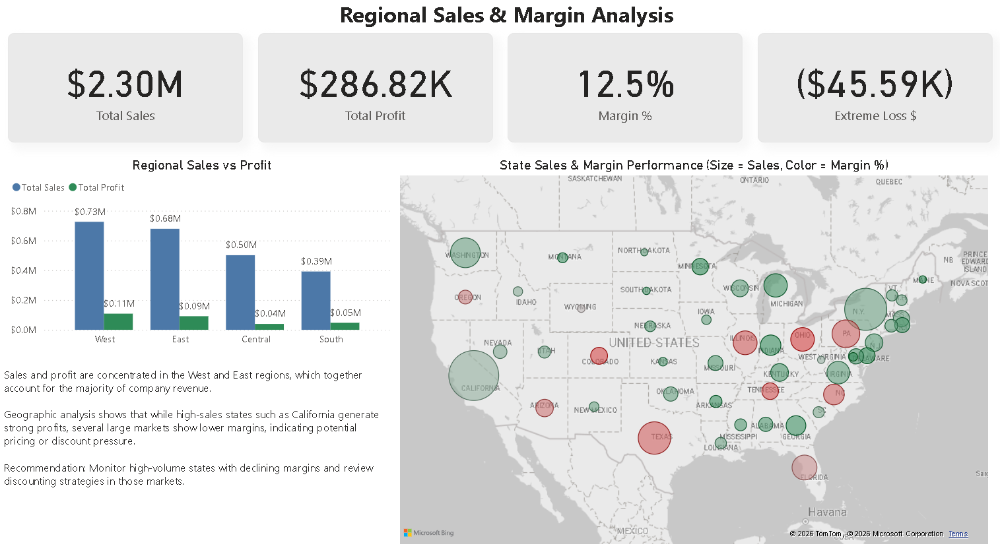
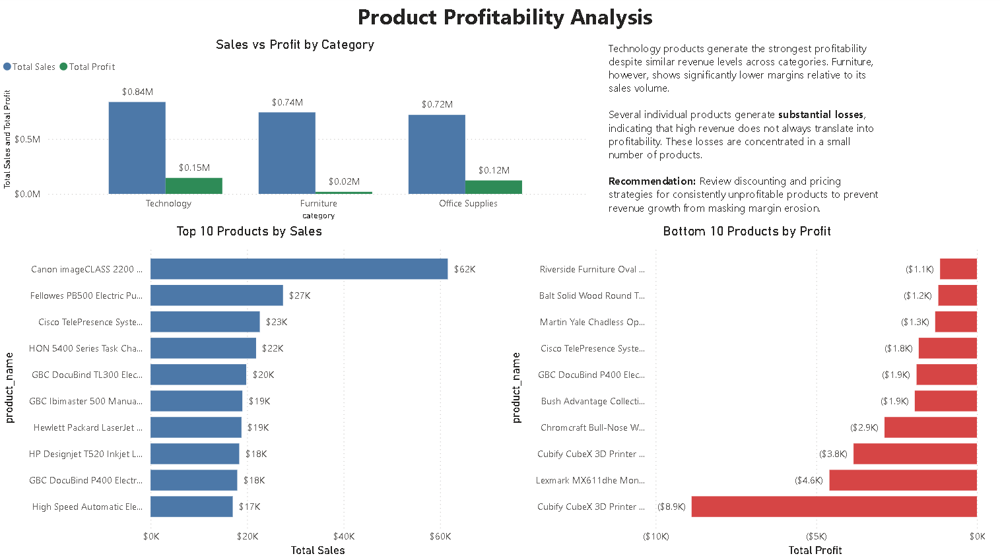
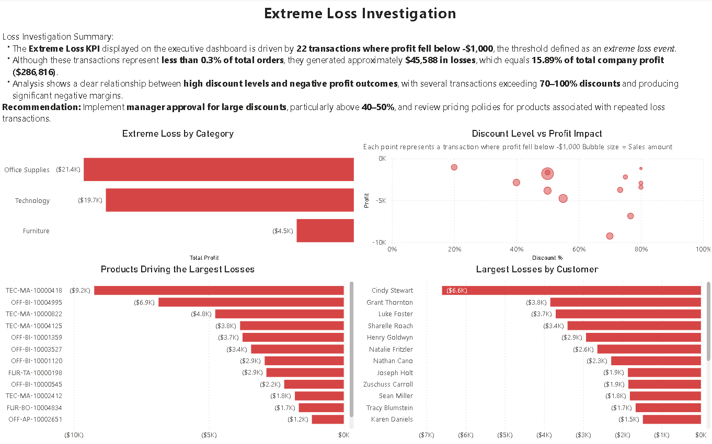

# Superstore Business Intelligence Project
SQL Server + Power BI

## Overview

This project demonstrates a complete **Business Intelligence workflow** using **SQL Server and Power BI**.

The goal is to transform raw sales data into an analytics-ready model and build dashboards that reveal key business insights such as profitability drivers, discount impact, and extreme loss transactions.

The project demonstrates:

- SQL star schema data modeling
- ETL pipeline using staging tables
- Analytical SQL views
- Interactive Power BI dashboards
- Business insight analysis

**Dataset:** Tableau Superstore sample dataset (~10k retail transactions)

---

## Business Question

What factors drive profitability in retail sales, and how can the business reduce loss-making transactions?

---

## Project Architecture

```
Raw CSV Dataset
      │
      ▼
SQL Staging Table
      │
      ▼
Dimension Tables
      │
      ▼
Fact Table
      │
      ▼
Analytical SQL Views
      │
      ▼
Power BI Dashboard
```

## Data Model

A **star schema** was implemented to support analytical queries.

Fact Table
- fact_sales

Dimension Tables

- dim_customer
- dim_product
- dim_date



---

## Power BI Dashboards

### Executive Performance Dashboard

Provides a high-level overview of sales, profit, and margin trends.



---

### Regional Sales & Margin Analysis

Compares revenue and profitability across regions.



---

### Product Profitability Analysis

Examines profitability by category, product, and discount level.



---

### Extreme Loss Investigation

Analyzes transactions generating losses greater than **$1,000**.



---

## Key Insights

• A small number of transactions generate disproportionate losses due to heavy discounting.

• Profitability varies significantly across product categories.

• Higher discount levels strongly correlate with lower profit margins.

• Regional performance differences highlight opportunities for targeted strategy.

---

## Business Recommendations

• Introduce approval thresholds for high discount levels.

• Monitor products with recurring negative margins.

• Implement dashboards to track extreme loss transactions.

• Review discount policies to prevent large loss events.

---

## Documentation

Additional project documentation:

• [Data Dictionary](documentation/data_dictionary.md)

---

## Repository Structure

```text
superstore-bi-analysis
│
├── data
│   └── Sample - Superstore.csv
│
├── sql
│   ├── 01_create_database.sql
│   ├── 02_create_staging.sql
│   ├── 03_load_staging.sql
│   ├── 03A_wizard_import_instructions.sql
│   ├── 04_build_dimensions.sql
│   ├── 05_build_fact.sql
│   ├── 06_create_views.sql
│   └── 07_eda_analysis.sql
│
├── powerbi
│   └── SuperStore.pbix
│
├── images
│   ├── data_model.png
│   ├── executive_dashboard.png
│   ├── regional_analysis.png
│   ├── product_profitability.png
│   └── extreme_loss_analysis.png
│
├── documentation
│   └── data_dictionary.md
│
└── README.md
```
---

## Author

Jeremy Selig
Data Analyst Portfolio


